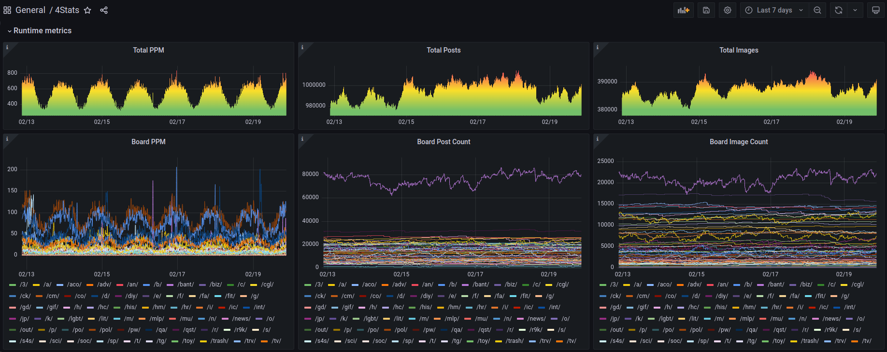
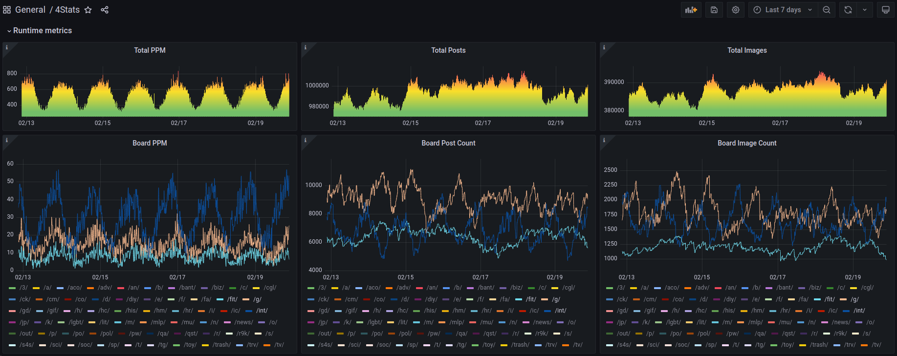

# 4Stats

4Stats uses 4chan's public API to gather statistics regarding the threads on the various boards.  
The data is exposed using Prometheus metrics to allow for visualization in Grafana.

**Note:** The project is currently under development and metrics may come to change

## Preview




## Deployment

Deployment is easy and requires nothing more than docker and docker-compose.


```sh
git clone https://github.com/ALX99/4stats
cd ./4stats
docker-compose up
```

**Note:**
- By default Grafana will be exposed on port 80 on all interfaces
- By default Prometheus will be exposed on port 9090 on localhost
- By default 4stats's metrics endpoint will be exposed 8000 on localhost
- Please see [docker-compose.yml](https://github.com/ALX99/4stats/blob/main/docker-compose.yml) for configuration options.


## Development

Task is required in order to build this project.

- Compile the project: ```task build```
- Compile & build the docker image: ```task image```
- Compile, build and start the project: ```task start```

**Note:** For more available options please see ```task --list-all```
